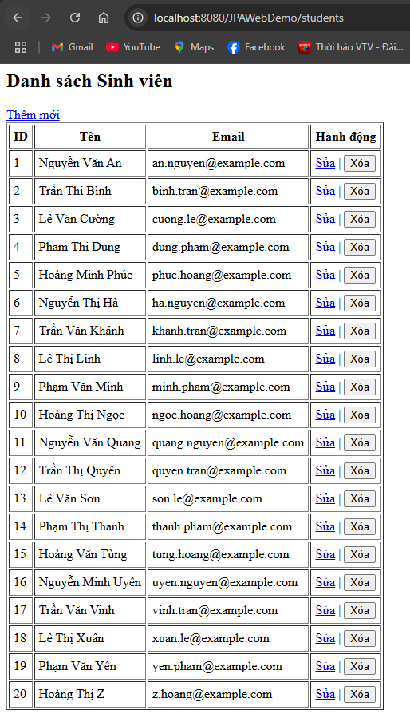
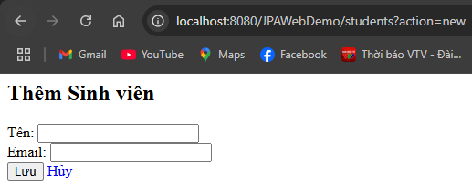
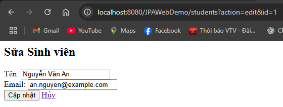
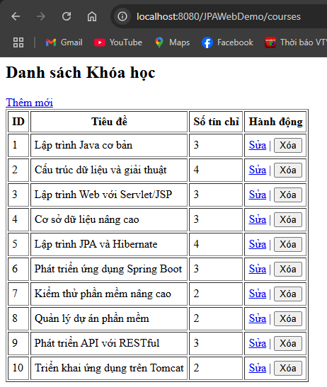
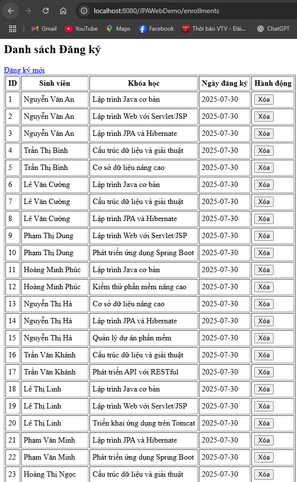

# JPA-JSP

[](LICENSE)

Dự án minh họa **Lập trình JPA (Java Persistence API)** trong môn học **Lập trình Java nâng cao**, triển khai theo mô hình **Servlet/JSP + JPA (Hibernate) + SQL Server**.  
Website hỗ trợ CRUD **Sinh viên – Khóa học** và quản lý **đăng ký khóa học (Many-to-Many)** qua bảng trung gian `Enrollments`.

---

## Tính năng

- **Quản lý Sinh viên (Student):**
  - Xem danh sách, thêm mới, chỉnh sửa, xóa.
- **Quản lý Khóa học (Course):**
  - Xem danh sách, thêm mới, chỉnh sửa, xóa.
- **Quản lý Đăng ký khóa học (Enrollment):**
  - Liên kết nhiều-nhiều giữa Sinh viên và Khóa học.
  - Xem danh sách đăng ký, thêm đăng ký mới, xóa đăng ký.
- **ORM với JPA/Hibernate:**
  - Mapping entity → bảng, tự động tạo bảng (`hbm2ddl.auto=update`).
- **CSDL:** SQL Server (có thể đổi sang MySQL).

---

## Công nghệ sử dụng

- **Ngôn ngữ:** Java 17+
- **Framework:** Jakarta Servlet/JSP (Jakarta EE 10)
- **ORM:** JPA 3.1 (Hibernate 6.x)
- **CSDL:** Microsoft SQL Server
- **Build Tool:** Maven
- **Server:** Apache Tomcat 10/11

---

## Cấu trúc thư mục

```css
JPAWebDemo/
│── src/main/java/com/example/jpaweb/
│ ├── entity/
│ │ ├── Student.java
│ │ ├── Course.java
│ │ └── Enrollment.java
│ ├── dao/
│ │ ├── StudentDAO.java
│ │ ├── CourseDAO.java
│ │ └── EnrollmentDAO.java
│ ├── servlet/
│ │ ├── StudentServlet.java
│ │ ├── CourseServlet.java
│ │ └── EnrollmentServlet.java
│ └── util/
│ └── JPAUtil.java
│
│── src/main/resources/META-INF/persistence.xml
│── src/main/webapp/
│ ├── students/ (list.jsp, add.jsp, edit.jsp)
│ ├── courses/ (list.jsp, add.jsp, edit.jsp)
│ └── enrollments/ (list.jsp, add.jsp)
│
│── pom.xml
│── README.md
│── LICENSE
```

---

## Cài đặt & Chạy dự án

### 1. Clone project

```bash
git clone https://github.com/<username>/JPAWebDemo.git
cd JPAWebDemo
```

### 2. Cấu hình database SQL Server
- Tạo database JPA_Demo:

```sql
CREATE DATABASE JPA_Demo;
GO
USE JPA_Demo;
```

-Thêm dữ liệu mẫu (20 sinh viên + 10 khóa học + 30 bản ghi đăng ký):

```sql
-- Dữ liệu Students
INSERT INTO Students (name, email) VALUES
(N'Nguyễn Văn An', 'an.nguyen@example.com'),
...
(N'Hoàng Thị Z', 'z.hoang@example.com');

-- Dữ liệu Courses
INSERT INTO Courses (title, credits) VALUES
(N'Lập trình Java cơ bản', 3),
...
(N'Triển khai ứng dụng trên Tomcat', 2);

-- Dữ liệu Enrollments
INSERT INTO Enrollments (student_id, course_id) VALUES
(1,1),(1,3),(2,2),...
```

### 3. Cấu hình persistence.xml
```xml
<property name="jakarta.persistence.jdbc.driver" value="com.microsoft.sqlserver.jdbc.SQLServerDriver"/>
<property name="jakarta.persistence.jdbc.url" value="jdbc:sqlserver://localhost:1433;databaseName=JPA_Demo;encrypt=false"/>
<property name="jakarta.persistence.jdbc.user" value="sa"/>
<property name="jakarta.persistence.jdbc.password" value="123456"/>
<property name="hibernate.dialect" value="org.hibernate.dialect.SQLServerDialect"/>
```

### 4. Build & Deploy
- Build WAR bằng Maven:

```bash
mvn clean package
```
- Copy file `target/JPAWebDemo.war` vào thư mục `webapps/` của Tomcat 10/11.
- Start Tomcat và truy cập:

```bash
http://localhost:8080/JPAWebDemo/students
http://localhost:8080/JPAWebDemo/courses
http://localhost:8080/JPAWebDemo/enrollments
```

---

## Giao diện mẫu
- Danh sách Sinh viên<br>

- Form Thêm Sinh viên<br>

- Form Chỉnh sửa Sinh viên<br>

- Danh sách Khóa học<br>

- Đăng ký Khóa học<br>


---

## Mở rộng
- Tìm kiếm sinh viên hoặc khóa học.
- Phân trang danh sách.
- Thêm xác thực đăng nhập admin/user.
- Xuất báo cáo PDF/Excel.

---

## Yêu cầu môi trường
- JDK 17+
- Apache Maven 3.8+
- Apache Tomcat 10/11
- SQL Server 2019/2022 (hoặc Azure SQL)

--- 

## Giấy phép
Phần mềm này được phát hành theo giấy phép MIT.

---

## Tác giả
- Tên: Hoàng Nghĩa Minh Bảo
- Môn học: Lập trình Java nâng cao
- Trường: Khoa Công nghệ Thông tin - Trường Đại học Đà Lạt
- Giảng viên: ThS. Đoàn Minh Khuê

---
